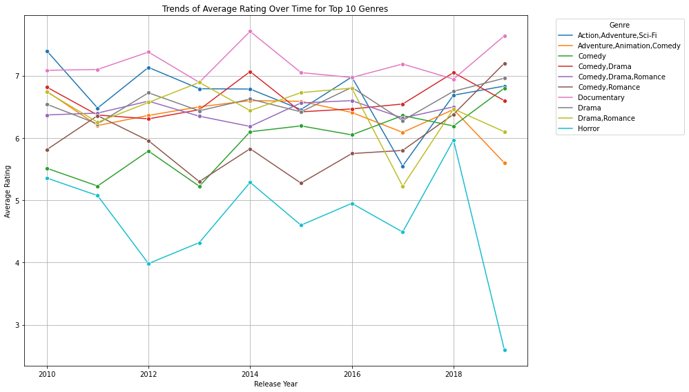
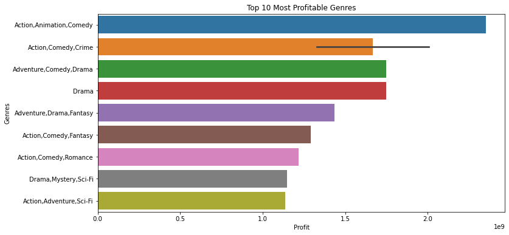
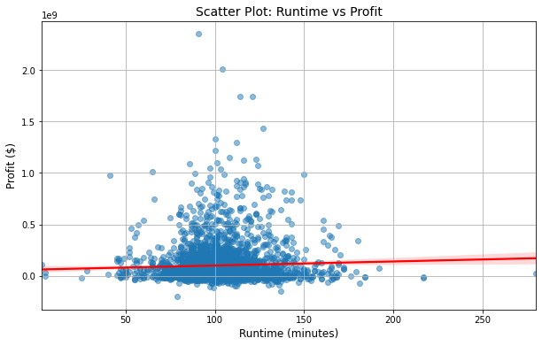

# Analyzing Movie Trends - What Films Perform Best at the Box Office?

## Overview
This project explores factors that contribute to a movie's box office success. Using data analysis and statistical models, we identify key trends and relationships between production budgets, genres, and audience reception.

## Business Understanding
The company sees major corporations creating original video content and wants to join the industry. However, they lack expertise in movie production. This project explores box office trends to provide actionable insights for launching a successful film studio. Key questions include:

✅ Which genres generate the highest revenue?  
✅ How do production budgets impact profitability?  
✅ What trends exist in audience preferences over time?  
✅ How does critical reception correlate with box office performance? 

## Data Understanding and Analysis
The dataset includes movie details such as worldwide gross revenue, production budgets, genres, ratings, and release years sourced from IMDB and The Numbers.  
We conducted exploratory data analysis (EDA) to uncover patterns and used statistical methods to validate key insights.  
### Key Columns Used For Analysis:
- **Movie** - Movie title  
- **Start_year** - Year of initial screening 
- **Runtime_minutes** - Duration of the film  
- **Genres** - Genre of the film  
- **Averagerating** - Average popularity rating of a film  
- **Numvotes** - Number of voters of a particular film  
- **Release_date** - Official date of release to the public  
- **Production_budget** - Cost of making the movie  
- **Domestic_gross** - Revenue brought in from the domestic market  
- **Worldwide_gross** - Revenue brought in from the global market  

## Key Insights
**1. Budget Drives Box Office Success** 
- Higher production budgets lead to significantly higher revenues.  
- Regression analysis shows budget is the strongest predictor of box office earnings, explaining 51-56% of revenue variance.  
**2. Profitable Genre Trends**  
- Drama leads in total profit, but Action, Adventure, and Comedy combinations have the highest mean and median profitability.  
- Documentaries are a hidden gem with high average profitability despite fewer releases.  
**3. Runtime & Profitability**  
- Most profitable movies tend to have runtimes between 90–150 minutes.  
- While runtime alone doesn’t predict revenue, optimizing it alongside budget and marketing efforts can improve success.  
**4. Audience Trends (2011–2018)**  
- Stable ratings: Documentaries consistently received high ratings.  
- Declining interest: Action, Adventure, and Sci-Fi genres saw a drop in audience ratings over time.  
- Consistent performers: Drama, Romance, and Comedy maintained steady audience engagement.  
**5. Box Office Success is More Than Just Budget** 
- Other crucial factors like marketing spend, star power, distribution strategy, and release timing play a key role in a movie’s financial performance.  

## Key Visuals





## Tools Used
- **Programming Language**: Python
- **Libraries:** pandas, seaborn, matplotlib, numpy, scipy, statsmodels, sqlite3

## Business Recommendations
- **💰 Smart Budgeting:** Allocate production budgets strategically to maximize revenue while maintaining cost efficiency.  
- **🎬 Diversify Investments:** Balance high-budget blockbusters with mid-budget films for optimized risk and returns.  
- **⏳ Optimize Runtime:** Aim for films between 90–150 minutes for maximum profitability.  
- **🎭 Genre Focus:** Invest in profitable genres like Action, Adventure, and Comedy while exploring high-potential Documentary films.  
- **🌟 Marketing & Star Power:** A strong marketing strategy and A-list actors can significantly boost a film’s success.  
- **🕰️ Strategic Release Timing:** Leverage seasonal trends and competitive analysis to maximize box office earnings.  
- **📊 Model Refinement:** Enhance predictive models by incorporating marketing spend, cast reputation, and audience demographics.   

## Folder Structure
```
📂 Phase-2-Project
 ├── data/                      # Raw and processed dataset  
 ├── images/                    # Images used in README  
 ├── .gitignore  
 ├── phase-2-project-Final.ipynb  # Jupyter Notebook with full analysis  
 ├── presentation.pdf            # Non-technical presentation  
 ├── README.md                   # Project Summary  
 
```

## Conclusion
This analysis provides valuable insights into movie performance trends, helping stakeholders make data-driven decisions in the film industry. Further research could include marketing budgets, streaming data, and audience demographics for a more comprehensive analysis.
